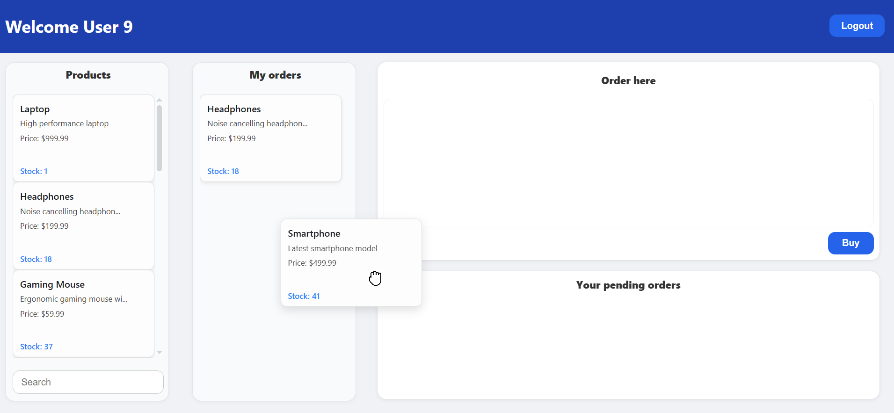
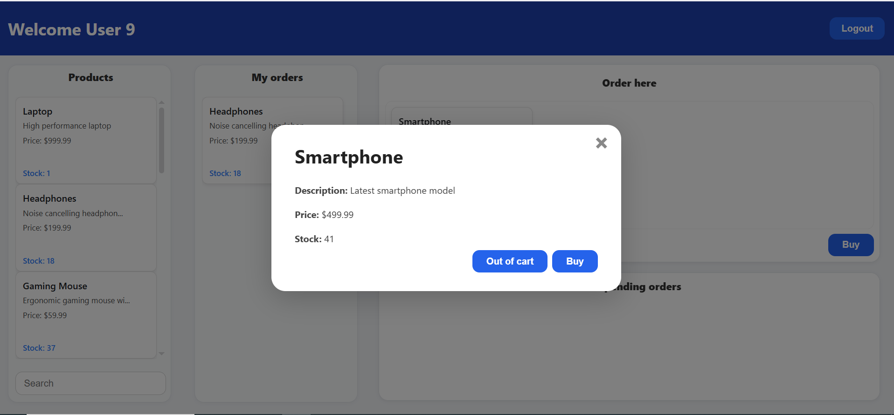

## Trello clone for the EBuy API

#### IMPORTANT
For this clone to work it needs the EBuy API! You first have to start the API by doing docker compose up!

#### Functionality
The cards can be dragged to cart and bought. You can also Add to cart using a button and remove cards from Cart using a button. Upon logging in it makes a backend request for all the products and the users orders. After clicking Buy a fetch call is made to buy the product and the card/s are moved to the Pending row, then a fetch call is amde again to check whether the order was successful and if it was the card/s are moved to the Order column. There is also a product search which makes a fetch call to dynamically search for products

